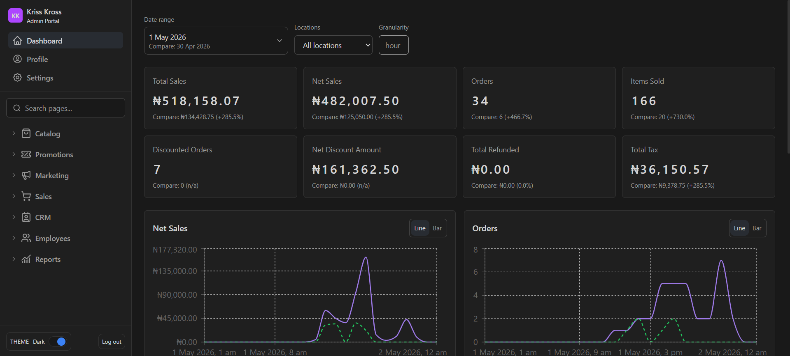
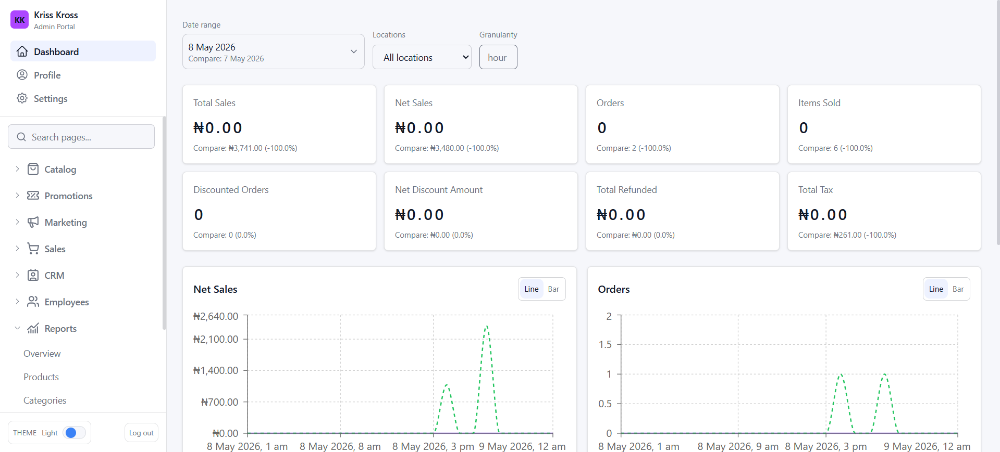
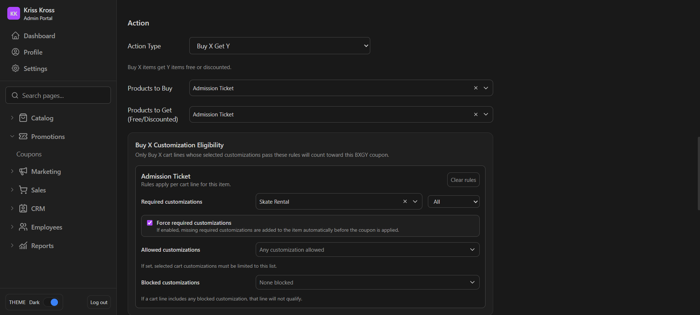
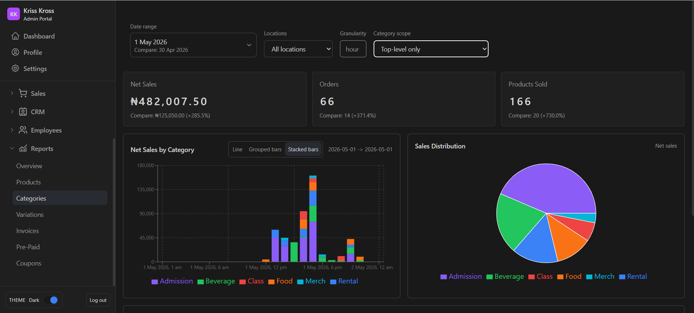
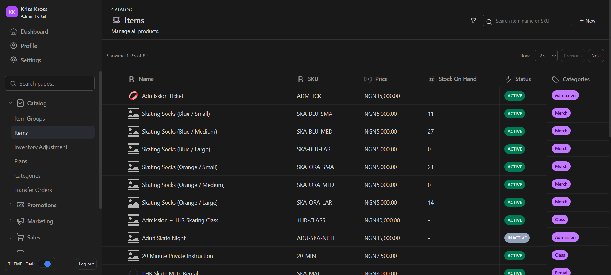
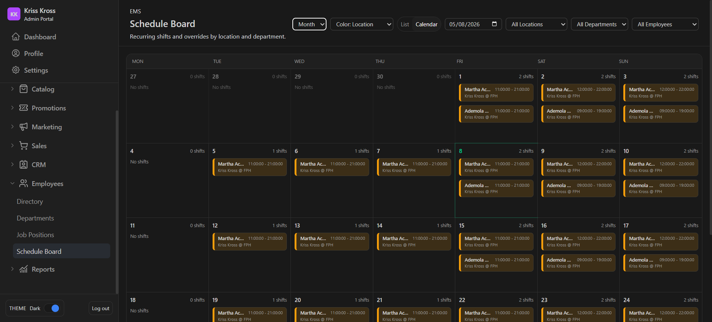
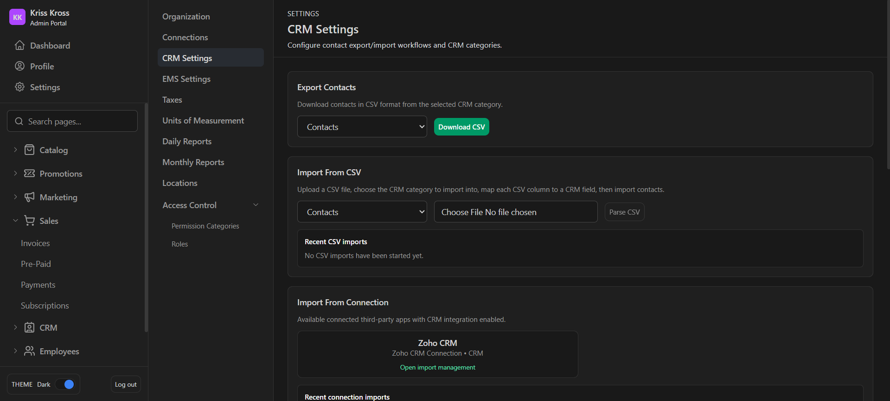
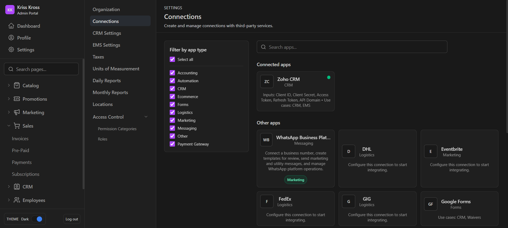
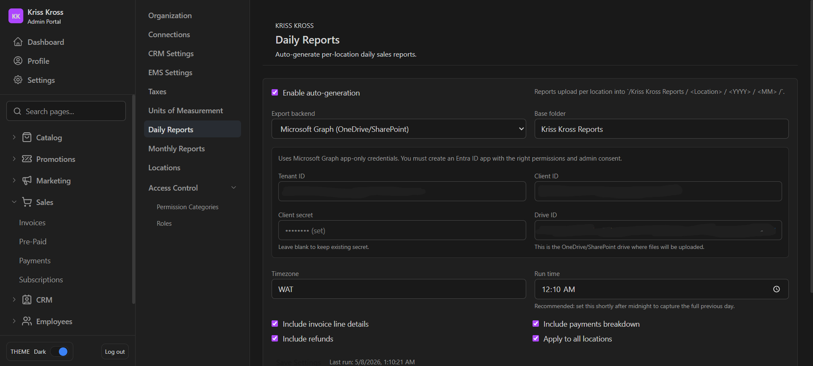

# Admin Portal

React 19 + Vite admin interface for the KrissKross operational back office. The
portal talks to the Django backend under `/api/*` and handles catalog, CRM,
sales, reports, EMS, promotions, and settings workflows.

## Live Test Version
### Admin Dashboard
Link: https://sandbox.admin.krisskrossskate.com/

Email: tester@gmail.com

Password: NewPass123!

### POS Plugin
Link: https://sandbox.pos.krisskrossskate.com/

Email: tester@gmail.com

Pin: 123456

## Screenshots

### Dashboard

### Promotions

### Reports

### Catalog

### Employee Scheduling

### Settings

## Local setup

1. Install dependencies with `npm install`.
2. Set `VITE_API_BASE_URL` if the backend is not running at `http://127.0.0.1:8000`.
3. Start the app with `npm run dev`.
4. Build the production bundle with `npm run build`.

## Architecture guide

- `src/main.tsx` bootstraps React Query, auth state, routing, and the initial theme.
- `src/routes/App.tsx` is the central route registry. It also hosts the auth and
  permission guards used by every feature area.
- `src/api/` contains backend-facing request modules. Shared query construction
  lives in `src/api/query.ts`, and shared pagination types live in `src/api/types.ts`.
- `src/auth/AuthContext.tsx` normalizes the backend auth payload and exposes the
  `can()` helper used by guarded routes and feature components.
- `src/screens/` contains page-level screens grouped by business domain.
- `src/components/` contains reusable UI building blocks that are shared across screens.
- `src/utils/theme.ts` scopes persisted theme preferences per user and portal.

## Backend assumptions

- The portal does not send `portal_id` during login or password reset. Backend
  portal inference is based on the request `Origin` matching a portal location URL.
- EMS pages depend on backend EMS migrations and seeded lookup values.
- Roles must include the expected permission categories for a user to reach the
  guarded routes in `src/routes/App.tsx`.

## POS Plugin

Check out the accompanying POS plugin here: https://github.com/oyindakrisskross/pos-portal
